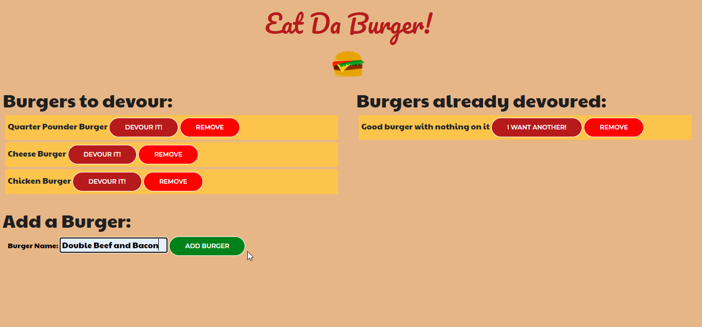

# Eat-Da-Burger

## Description: 
Ready for a bit of fun? Feeling hungry? Design your ultimate burger! 
Welcome to my burger logger application built with MySQL, Node.js, Express, and Express Handlebars and ORM.
Access the application through this link: https://damp-mesa-71184.herokuapp.com/burgers 

## Table of Contents 
* [Installation](#Installation) 
* [Usage Information](#Usage) 
* [Contributing](#Contributing) 
* [Test Instructions](#Tests) 
* [Questions](#Questions) 
* [License](#License)  

## Installation: 
1. Clone the Eat-Da-Burger project files to your local machine using this link: https://github.com/ong-osmond/Eat-Da-Burger.git  
2. Install NODE.js on your machine. Find the latest version on https://nodejs.org/en/
3. Open Git Bash or any Command Line tool and type in "NPM INSTALL". 
4. Install the Inquirer module by typing in "NPM INSTALL EXPRESS".
5. Install the MYSQL module by typing in "NPM INSTALL MYSQL".
6. Install MySQL Server on your machine. Set the host to "localhost" and the port to "3306". Create a user with Standard Authentication Type. 
7. On the project's db folder, use the "SCHEMA.SQL" and "SEEDS.SQL" file to create the database and set up initial data.
8. Start your MySQL server before using the app. 

Note: The config "CONNECTION.JS" file handles the connections in the Heroku environment. The project preview uses the JAWSDB_URL MYSQL add-on where the db SQL files have already been set up.

## Usage: 

This is the link to a video demonstrating the application: https://drive.google.com/file/d/1U1YFrENTWoP1tobVR2hsfs2ARc4A6l6Z/view?usp=sharing

To add a burger, type in a Burger Name and click on the "ADD BURGER" button. The burger is added to the "Burgers to Devour" list.

To move a burger from "Burgers to Devour" to "Burgers Already Devoured", click on that burger's "DEVOUR IT!" button.

To move a burger from "Burgers Already Devoured" to "Burgers to Devour", click on that burger's "I WANT ANOTHER!" button.

To remove a burger from the page, just click on that burger's "REMOVE" button. 

## Contributing: 
Everyone is welcome to contribute to this project. Please email me at ong.osmond@yahoo.com or fork the project from GitHub to your own repository.

## Tests: 
No tests have been implemented yet.
 
## Questions: 
Please visit my [GitHub Page](https://github.com/ong-osmond/) or email me your questions at ong.osmond@yahoo.com. 
I am available 8am-4pm Monday-Friday (Australian Western Standard Time). 

## License: 
MIT License

Copyright (c) 2020 Osmond Ong

Permission is hereby granted, free of charge, to any person obtaining a copy
of this software and associated documentation files (the "Software"), to deal
in the Software without restriction, including without limitation the rights
to use, copy, modify, merge, publish, distribute, sublicense, and/or sell
copies of the Software, and to permit persons to whom the Software is
furnished to do so, subject to the following conditions:

The above copyright notice and this permission notice shall be included in all
copies or substantial portions of the Software.

THE SOFTWARE IS PROVIDED "AS IS", WITHOUT WARRANTY OF ANY KIND, EXPRESS OR
IMPLIED, INCLUDING BUT NOT LIMITED TO THE WARRANTIES OF MERCHANTABILITY,
FITNESS FOR A PARTICULAR PURPOSE AND NONINFRINGEMENT. IN NO EVENT SHALL THE
AUTHORS OR COPYRIGHT HOLDERS BE LIABLE FOR ANY CLAIM, DAMAGES OR OTHER
LIABILITY, WHETHER IN AN ACTION OF CONTRACT, TORT OR OTHERWISE, ARISING FROM,
OUT OF OR IN CONNECTION WITH THE SOFTWARE OR THE USE OR OTHER DEALINGS IN THE
SOFTWARE.